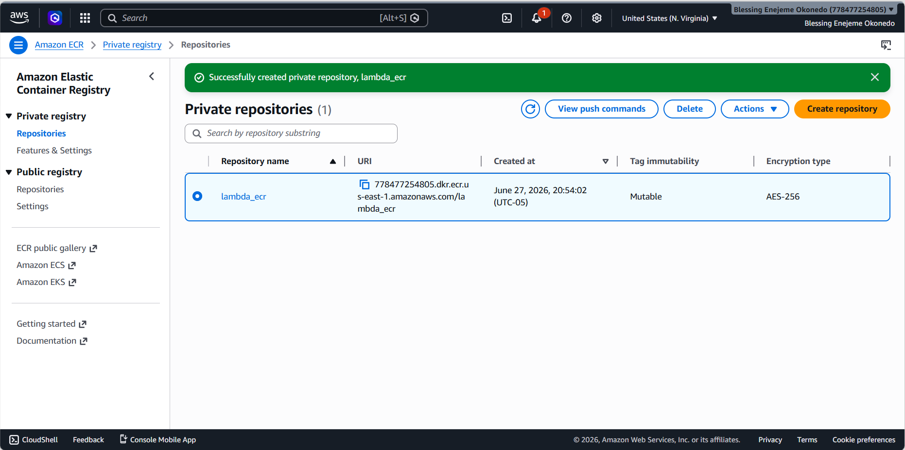
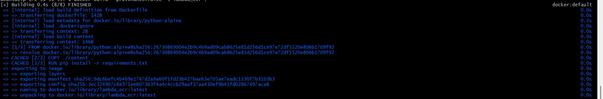
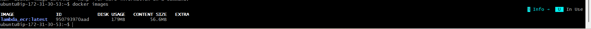
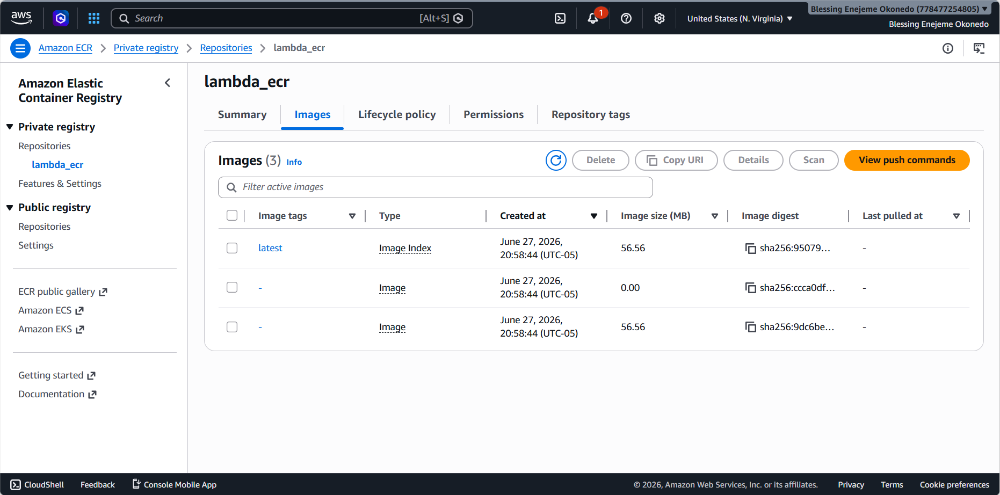
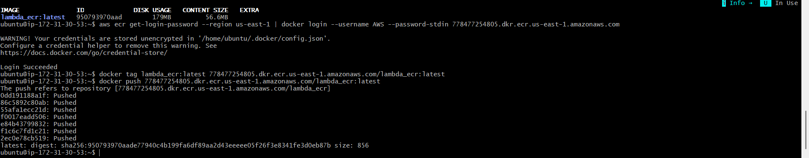
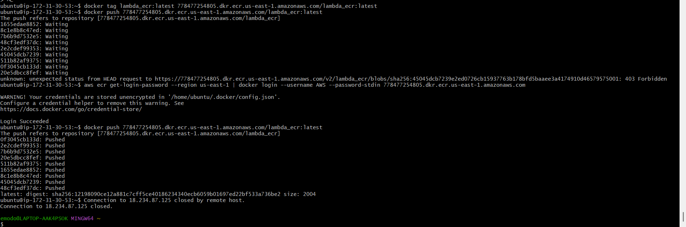
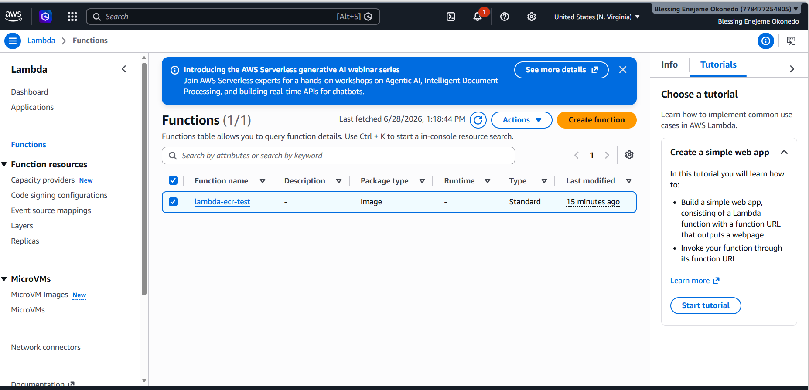
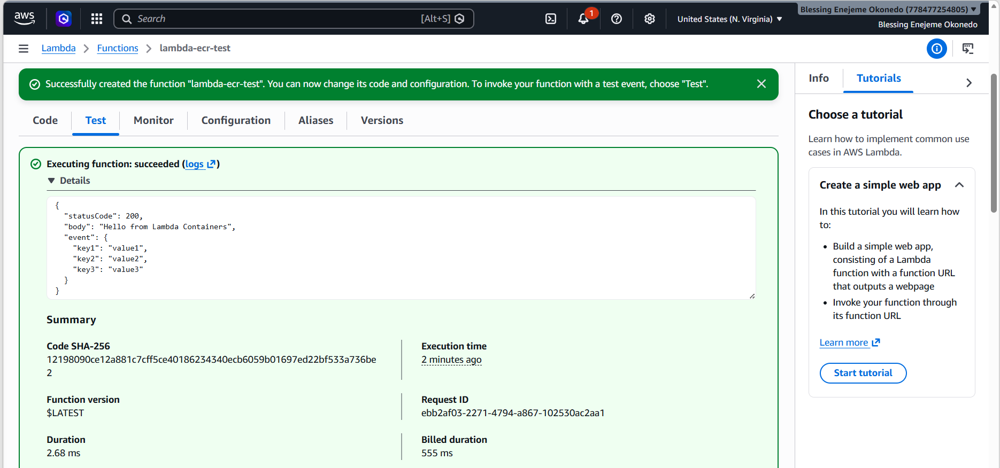

# Containerized AWS Lambda with Docker & ECR

Deploying an AWS Lambda function as a Docker container image — built on EC2, pushed to a private Amazon ECR repository, and run as a container-based Lambda function — completed as part of Great Learning's cloud computing coursework.

> **Where this fits in my learning path:** like my [Azure OwnCloud project](https://github.com/love4jeme/azure-owncloud-secure-storage), this was manual, console/CLI-driven work rather than Infrastructure-as-Code — the goal here was specifically to understand Lambda's *container image* deployment model (as opposed to the more common zip-file deployment), and to get hands-on with the Docker/ECR toolchain that underpins it.

---

## What Was Built

1. **EC2 build environment** — an Ubuntu instance used purely as a Docker build host (not a runtime environment for the application itself).
2. **A Python Lambda handler**, packaged into a Docker image.
3. **A private Amazon ECR repository** (`lambda_ecr`) to store the built image.
4. **A Lambda function** (`lambda-ecr-test`) created directly from the ECR image — Lambda's container-based deployment model, rather than a traditional zip upload.
5. **Verification** — a test invocation confirming the function executes correctly inside its container.

---

## Two Real Problems, Solved

This project didn't go smoothly on the first attempt — which is exactly what makes it worth documenting. Two genuine, separate issues came up and were root-caused and fixed:

### 1. SSH connectivity failure — detached Internet Gateway

Before any Docker work could start, SSH into the EC2 instance failed outright. Rather than guessing, I ruled out causes systematically, in order: security group rules, local firewall software (McAfee Advanced Firewall), Windows Defender Firewall outbound rules, and ISP/router-level blocking (tested by switching to a mobile hotspot to isolate whether the problem was local-network-specific). None of those were the cause. The actual root cause was at the VPC level: the **Internet Gateway had become detached** from the VPC, meaning the instance had no route out to the internet at all, regardless of security group configuration. Reattaching it resolved SSH access immediately.

### 2. Lambda rejected the image — OCI manifest vs. Docker V2 Schema 2

The first successful build and push (using a generic `python:alpine` base image) produced an image that Lambda flatly refused to run, citing an unsupported image manifest.

**Root cause:** modern Docker, using Buildx as its default builder, produces images in the newer **OCI image format** by default — including, for multi-platform builds, an "Image Index" manifest wrapping multiple platform-specific images. AWS Lambda specifically requires the older **Docker V2 Schema 2** manifest format and does not accept the OCI index wrapper.

**What I tried first**, in order, before finding the real fix:
- `DOCKER_BUILDKIT=0` — no effect (this variable only matters on older Docker installs where the classic builder is still default; this instance was running Docker 29.6.1, where Buildx is the default builder regardless)
- `--provenance=false` — reduced the extra attestation/provenance layers, but the underlying image format issue remained
- `docker build --output type=docker` — explicitly forcing legacy Docker output format

**The actual fix:** rebuilding from AWS's own official Lambda base image (`public.ecr.aws/lambda/python:3.12`) instead of a generic Python image, combined with `--provenance=false`. AWS's Lambda base images are specifically built to produce Lambda-compatible manifests — this also let me simplify the Dockerfile by removing a hand-rolled Lambda Runtime Interface Client (`bootstrap.py`) that the original workbook's starter package included, since AWS's base image handles the Lambda runtime interface natively.

A secondary, smaller issue also came up during the final push: a `403 Forbidden` error from ECR, caused by an expired Docker login token (ECR auth tokens last 12 hours). Re-authenticating with `aws ecr get-login-password | docker login` resolved it.

---

## Verified Proof

**ECR repository created**

**Docker image built (first attempt, generic base image)**

**Built image confirmed locally**

**Image pushed to ECR — note the "Image Index" type, the OCI manifest wrapper Lambda rejected**

**Push command output, including the ECR token refresh (403 → re-login → success)**

**Final successful push, after rebuilding from the AWS Lambda base image**

**Lambda function created successfully from the fixed image**

**Test invocation succeeded — 200 response, 2.68ms execution**

---

## From Console to Code

Like the Azure OwnCloud project, this was deliberately hands-on, CLI- and console-driven work — no Terraform involved. Beyond the Lambda container deployment model itself, the real value here was the debugging process: ruling out causes systematically rather than guessing (for the IGW issue), and understanding *why* a fix works rather than just applying it (recognizing that `--provenance=false` alone wasn't enough, and that the real fix was switching to a purpose-built base image rather than fighting the generic one with build flags). That same discipline — read the actual error, form a hypothesis, test it, move to the next hypothesis if it's wrong — is exactly what carried over into diagnosing real issues later in [TemsFidelity Bank](https://github.com/love4jeme/temsfidelitybank), like the ArgoCD `ApplicationSet` CRD crash loop.
